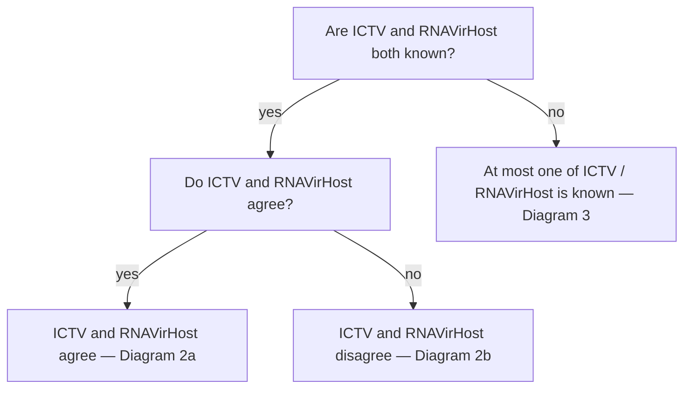
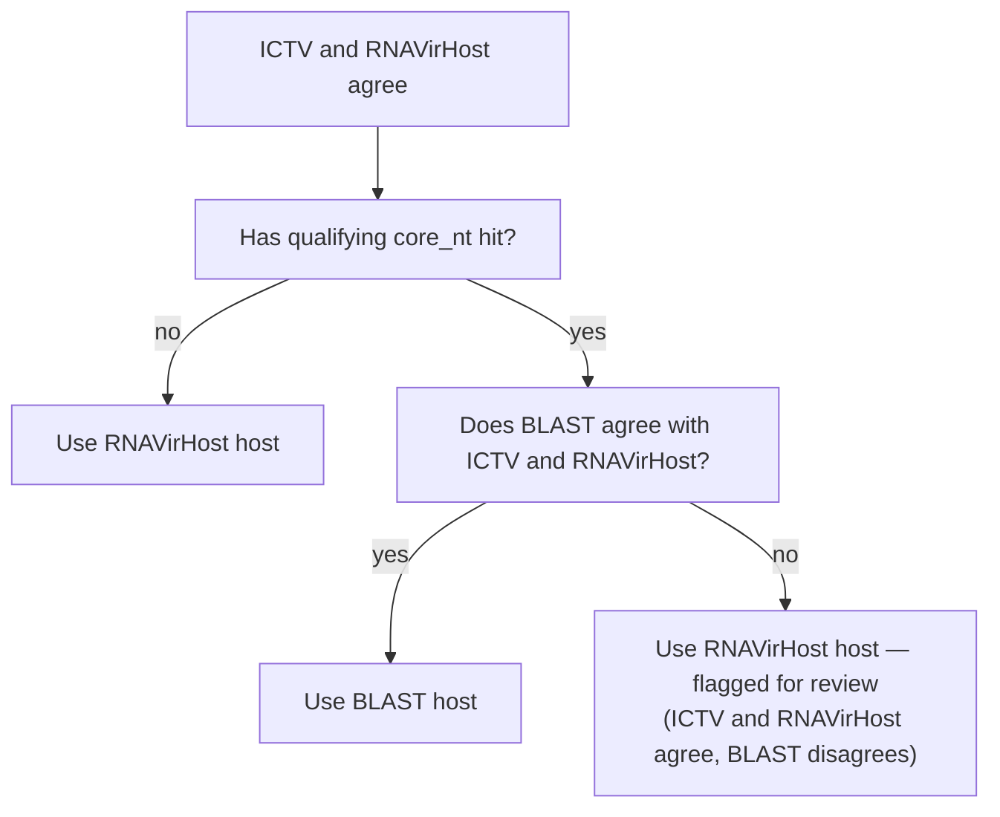
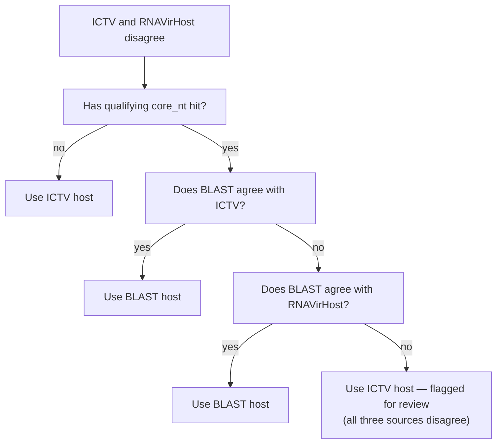
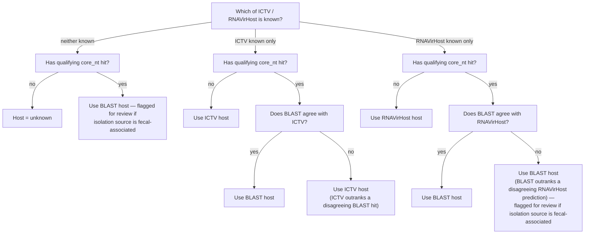

# Host determination in wvdb_annotate (`GUESS_HOST`)

## Overview

Determining the host for viral genomes recovered from metagenomic
sequence data is an ongoing area of research. Most work has
historically focused on DNA bacteriophage, and many tools explicitly
report that host prediction is limited for novel RNA bacteriophage
and/or eukaryotic viruses.

Here, we take a decision-tree-based approach that combines three host
prediction methods:

1. **ICTV host range** — family-level taxonomy determined earlier in
   wvdb-annotate is used to collect host range information from the
   [ICTV Virus Properties table](https://ictv.global/virus-properties).
2. **GenBank metadata via BLAST** — BLAST hits to `core_nt` are used to
   pull host information from GenBank entries.
3. **RNAVirHost** — a machine-learning model
   ([Chen et al. 2024](https://doi.org/10.1093/gigascience/giae059))
   that predicts host using order-level taxonomy determined earlier in
   wvdb-annotate.

The output is a `host_final` column within `final_annotations.tsv` (the
final output table when `--run_guess_host true`; see the main
[README's output structure](README.md#output-structure)) that categorizes
the predicted host, typically as one of: `vertebrates`, `invertebrates`,
`plants`, `bacteria`, `fungi`, `unknown`, `other`. Detailed descriptions
of these host-determination methods are included below, along with a
decision tree and accompanying rationale.

**Given highly novel genomes from environmental sources, host
predictions may not be accurate.**

---

This document explains the reasoning behind `bin/guess_host.py`'s host
determination logic and walks through its decision tree in full. For
setup and running instructions, see the main [README](README.md#host-prediction-guess_host).

## ICTV host

"ICTV" in this document is shorthand for a two-step lookup, not a direct
tool output — nothing in the pipeline calls ICTV's servers at
annotation time. This section defines exactly what it is, since the
term isn't explicit anywhere else.

**Step 1 — family-level taxonomy.** Two tools each attempt a family-level
classification for every vOTU: geNomad and RdRPCATCH. `merge_annotations.py`
combines them into a single `Family_consensus` column with a simple
fallback rule — **RdRPCATCH's family is used whenever it has one at
all**; geNomad's family is only consulted when RdRPCATCH found no RdRp
domain to classify. RdRpCATCH is prefered because it classifies from the RdRp
gene itself, a more direct taxonomic signal than geNomad's whole-genome
approach. If neither tool produced a family, `Family_consensus` is
`"Unclassified"`.

**Step 2 — host lookup by family.** `Family_consensus` is then used to
look up a row in the bundled, simplified ICTV family reference table
(`ref_data/ictv_families.tsv`), giving the `host_ICTV` value that
`guess_host.py` actually reads. This is the **raw** host string from
ICTV's own page — e.g. `"plants, invertebrates"` — not a further-
simplified single category. It can be a list because ICTV's source page
itself documents many virus families as infecting more than one broad
host group, and that structure is preserved rather than collapsed.

`ref_data/ictv_families.tsv` is prepared by `bin/prepare_ictv.py` from a manually-saved copy of
ICTV's virus properties page (currently
https://ictv.global/virus-properties — ICTV's own site has previously
referred to the same table at
`https://ictv.global/report/information/virus-properties`; check the
main [README](README.md#updating-reference-data) for the current
working instructions if you're regenerating this file). Exactly four
columns are extracted per family — `Family`, `Host`, `Genome size
(kb/kbp)`, `Genome topology` — and renamed to `Family_ICTV`, `host_ICTV`,
`size_kb_ICTV`, `topology_ICTV`. `host_ICTV` is kept in its original,
potentially multi-value form.

Note that `prepare_ictv.py` *also* derives a `host_ICTV_simple` column, which
collapses ICTV's many raw host-combination strings (e.g. "plants,
invertebrates", "fungi, plants, invertebrates, vertebrates") down into 9
broad categories in case the user wants to filter on this directly.

---

## BLAST against core-nt

`guess_host.py` considers hits against the `core_nt` database, specifically the free-text `host` and
`isolation_source` fields pulled from GenBank via Entrez in
`merge_annotations.py`.

`merge_annotations.py` classifies every
query's single best `core_nt` hit (by percent identity × query
coverage) into one of three tiers:

| Tier | Threshold |
|---|---|
| species-level | percent identity ≥ 95% **and** query coverage ≥ 85% |
| genus-level | percent identity ≥ 70% **and** query coverage ≥ 85% |
| none | below both |

**Only genus- or species-level hits trigger the Entrez lookup.**
The decision tree below refers to this as "has a qualifying core_nt hit" — it
meaning that the hit cleared this genus/species identity+coverage bar.

---

## Decision tree rationale: ICTV > BLAST > RNAVirHost

`guess_host.py` combines the three signals as follows:

**ICTV** (via `Family_consensus`) is viewed as the most trustworthy in principle —
it reflects curated, real host associations for known viruses in that
taxonomic family. Its failure mode is indirect: if `Family_consensus`
itself is wrong (a classification error upstream in geNomad/RdRPCATCH's
taxonomy calls), the ICTV-derived host will inherit that error.

**BLAST** (`core_nt`, qualifying hits only) is real observational data —
an actual submitted sequence with actual metadata, not a model's guess.
Its failure mode is that the `host` field is filled in by the original
submitter and is sometimes the *diet* of the sampled organism rather
than the true viral host — this is a particular risk for fecal or
digestive-tract samples, where a virus infecting a food item can appear
to have been "isolated from" the animal that ate it.

**RNAVirHost** is a trained model, and has been observed to make clear
misclassifications on real data. It is treated as the least reliable of
the three.

This gives an effective trust ordering of **ICTV > BLAST > RNAVirHost**.
That ordering only becomes decisive when exactly one of ICTV/RNAVirHost
is known and it conflicts with BLAST — see Diagram 3 below, where this
produces intentionally different outcomes depending on which single
signal is available.

---

## Decision tree

Because ICTV can hold multiple comma-separated values (e.g. `"plants, invertebrates"`) —
a family that is known to infect more than one broad host group, agreement means RNAVirHost's (or BLAST's) single value is a **member**
of that list, not an exact match to the whole list. This is also why
agreement resolves to BLAST's or RNAVirHost's single value rather than
ICTV's full list: if ICTV says "plants, invertebrates" and BLAST
independently says "plants", the code chooses "plants".

### Diagram 1 — top-level split



### Diagram 2a — ICTV and RNAVirHost agree



### Diagram 2b — ICTV and RNAVirHost disagree



### Diagram 3 — at most one of ICTV / RNAVirHost known



Note that the isolation-source fecal flag is relevant only when BLAST is effectively
being used **alone** — either because neither classifier had an opinion
at all, or because the one classifier that did have an opinion
(RNAVirHost) was outranked and set aside. It does not apply when BLAST
simply corroborates an already-known signal, since in that case the
host call isn't resting on BLAST's metadata by itself.

---

## Manual corrections applied after the decision tree

A handful of taxonomic corrections are applied to `final_host_determination`
after the tree above has already produced a result. These are independent,
flat rules — not additional branches in the tree:

| Rule | Effect | Auto-corrected? |
|---|---|---|
| `Order_consensus` is `Unclassified` **and** `Class_gNd`/`Class_RdRp` is one of `Leviviricetes`, `Caudoviricetes`, `Vidaverviricetes`, `Faserviricetes` | host → `bacteria` | Yes |
| `Order_consensus` is `Norzivirales` or `Timlovirales` | host → `bacteria` | Yes — these orders are well-established as bacteria-infecting regardless of what the tree above concluded |
| `Order_consensus` is `Martellivirales` and the result isn't already `plants` | — | **No** — also written to `manual_review.tsv`. Martellivirales is usually but not always plant-associated, which isn't reliable enough to auto-correct |
| A host category has fewer than `--guess_host_other_threshold` (default 100) vOTUs total | consolidated into `other` in the `host_final` column | Yes, for reporting only — `final_host_determination` is left unchanged |

---

## Reviewing results

Every row in `final_annotations.tsv` carries `review_flag` and
`review_reason` from the decision tree above, plus `final_tool_used` so
you can see exactly which source(s) contributed to the call. Rows
needing a second look for taxonomic reasons (Martellivirales-style
cases) are also output to `manual_review.tsv`.

Note: The decision tree does **not** flag every disagreement — specifically,
the "ICTV outranks a disagreeing BLAST hit" outcome (Diagram 3) and any
case where RNAVirHost-only-known-and-BLAST-agrees are left unflagged,
since these are considered ordinary, expected outcomes of the trust
ordering rather than genuine ambiguity. If you want to spot-check the
unflagged ICTV-vs-BLAST disagreement case specifically:

```python
import pandas as pd
df = pd.read_csv("final_annotations.tsv", sep="\t")

ictv_only_blast_disagrees = df[
    (df["final_tool_used"] == "ICTV") &
    (df["blast_exists"] == True) &
    (df["rnavirhost_domain"] == "unknown")
]
```
