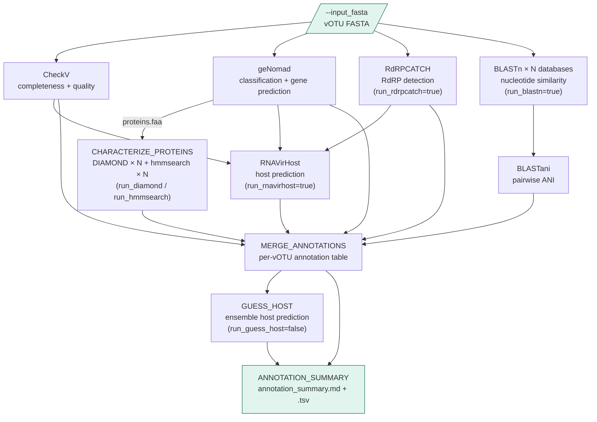

# wvdb_annotate

Viral genome annotation pipeline. Takes a FASTA file of viral genomes
(e.g. the `vclust_centroids.fasta` output of `wvdb_build`) and produces
completeness assessment, classification, RdRP detection, nucleotide and
protein similarity searches, host prediction, and a merged per-vOTU
annotation table.

This pipeline lives in the `wvdb-annotate/` subdirectory of the wvdb
repository, alongside `wvdb-build/`.

---

## Pipeline overview



All steps except RNAVirHost run in parallel from the input FASTA.
RNAVirHost runs sequentially after CheckV, geNomad, and RdRPCATCH complete,
as it requires their outputs to generate its consensus order classification.

### Step control

| Step | Default | Param to disable/enable |
|---|---|---|
| CheckV | always on | — |
| geNomad | always on | — |
| RdRPCATCH | on | `--run_rdrpcatch false` |
| BLASTn | on | `--run_blastn false` |
| DIAMOND | off | `--run_diamond true` |
| hmmsearch | off | `--run_hmmsearch true` |
| RNAVirHost | on | `--run_rnavirhost false` |
| GUESS_HOST | off | `--run_guess_host true` |

---

## Repository structure

```
wvdb-annotate/
├── main.nf                         # Entry point; wires all annotation steps
├── nextflow.config                 # Params, profiles (local, slurm, slurm_nomem, cluster, conda, test)
├── conf/
│   └── base.config                 # Per-process CPU/memory resource labels
├── modules/
│   ├── checkv.nf                   # CheckV quality assessment
│   ├── genomad.nf                  # geNomad classification + gene prediction
│   ├── rdrpcatch.nf                # RdRPCATCH RdRP detection (separate conda env)
│   ├── blastn_tools.nf             # BLASTN + BLASTANI (one process per database, parallel)
│   ├── protein_tools.nf            # DIAMOND, HMMSEARCH, PROTEIN_SUMMARY
│   ├── rnavirhost.nf               # RNAVirHost host prediction (separate conda env)
│   └── summary.nf                  # MERGE_ANNOTATIONS, PREPARE_ICTV, GUESS_HOST,
│                                   #   ANNOTATION_SUMMARY
├── subworkflows/
│   └── characterize_proteins.nf   # DIAMOND × N + hmmsearch × N in parallel
├── bin/                            # Python scripts (auto-added to PATH by Nextflow)
│   ├── blastani_nayfach.py         # Compute pairwise ANI from blastn tabular output
│   ├── merge_annotations.py        # Combine all annotation outputs per vOTU
│   ├── run_rnavirhost.py           # RNAVirHost wrapper + consensus order generation
│   ├── guess_host.py               # Ensemble host prediction (optional LLM)
│   ├── prepare_ictv.py             # Process ICTV family HTML → ictv_families.tsv
│   ├── parse_hmmsearch.py          # Parse hmmsearch --domtblout to clean TSV
│   └── summarize_protein_hits.py   # Per-contig protein hit counts
├── envs/
│   ├── wvdb_annotate.yml           # Main conda environment
│   ├── wvdb_rdrpcatch.yml          # Separate env for RdRPCATCH (Python 3.12)
│   └── wvdb_rnavirhost.yml         # Separate env for RNAVirHost (pinned ML deps)
├── ref_data/
│   └── ictv_families.tsv           # Bundled ICTV family table (MSL Jan 2026)
└── test/
    └── data/
        └── test_votus.fasta        # Small test input
```

---

## Dependencies

Three conda environments are required due to conflicting Python version and
dependency constraints between tools.

### Main environment (`wvdb-annotate`)

| Tool | Version | Notes |
|---|---|---|
| Nextflow | ≥ 23.10 | Requires Java 11+ |
| checkv | ≥ 1.0.3 | |
| genomad | ≥ 1.8.0 | Requires separate database download |
| blastn | 2.16.0+ | Via `blast` conda package |
| diamond | ≥ 2.0.9 | Protein search |
| hmmer | ≥ 3.3.2 | hmmsearch for HMM profile searches |
| Python | 3.11 | biopython (SeqIO, Entrez), pandas, numpy, requests, lxml |

### RdRPCATCH environment (`rdrpcatch`)

Separate environment required — RdRPCATCH needs Python 3.12.

### RNAVirHost environment (`rnavirhost`)

Separate environment required — RNAVirHost requires pinned versions of
pandas (2.0.3), scikit-learn (1.1.3), and xgboost (1.7.4) that conflict
with other tools.

---

## Installation

### 1. Create the main conda environment

```bash
mamba env create -f envs/wvdb_annotate.yml
# If mamba fails: conda env create -f envs/wvdb_annotate.yml
conda activate wvdb-annotate
```

### 2. Create the RdRPCATCH environment

RdRPCATCH requires Python 3.12 and cannot share the main environment.

```bash
# Option A — install from bioconda directly (recommended)
conda create -n rdrpcatch -c bioconda rdrpcatch

# Option B — create from the provided yml
mamba env create -f envs/wvdb_rdrpcatch.yml
```

Download the RdRPCATCH databases:

```bash
conda activate rdrpcatch
rdrpcatch databases --destination-dir /path/to/rdrp_catch_db
```

The pipeline activates the `rdrpcatch` environment automatically for the
`RDRPCATCH` process via a per-process `conda` directive in `nextflow.config`.
Override the path if installed at a non-standard prefix:

```bash
nextflow run main.nf --rdrpcatch_conda_env /path/to/conda/envs/rdrpcatch ...
```

### 3. Create the RNAVirHost environment

RNAVirHost requires pinned ML dependency versions that conflict with the
main environment.

```bash
mamba env create -f envs/wvdb_rnavirhost.yml
conda activate rnavirhost
rnavirhost --help   # confirm installation
```

The pipeline activates this environment automatically for the `RNAVIRHOST`
process. Override the path if needed:

```bash
nextflow run main.nf --rnavirhost_conda_env /path/to/conda/envs/rnavirhost ...
```

### 4. Download the geNomad database

```bash
conda activate wvdb-annotate
genomad download-database /path/to/genomad_db/
```

Alternatively, download manually from Zenodo:
https://github.com/apcamargo/genomad

### 5. Download the CheckV database

```bash
checkv download_database /path/to/checkv-db/
```

### 6. Prepare the ICTV family reference file

A processed copy is bundled in `ref_data/ictv_families.tsv` (MSL January 2026)
and used by default — no setup required for most users. To update, see
[Updating reference data](#updating-reference-data).

### 7. Build BLAST databases

For each FASTA in your databases CSV, build the BLAST index if not already done:

```bash
makeblastdb -in /path/to/db.fna -dbtype nucl -out /path/to/db.fna
```

All index files must reside in the same directory as the `.fna` file.

### 8. Validate the pipeline DAG

```bash
cd wvdb-annotate
nextflow run main.nf -stub -profile local \
    --run_blastn false
```

---

## Database configuration

All annotation databases (BLASTn, DIAMOND, hmmsearch profiles) are specified
in a single unified CSV file:

```csv
type,name,path
blastn,IMGVR,/p/vast1/mlbiomon/ref_data/IMG-VR_2025-12-02/IMGVR5_UViG.fna
blastn,CHVD,/p/vast1/mlbiomon/ref_data/CHVD_tisza2021/CHVD_virus_sequences_v1.1.fasta
blastn,UHGV,/p/vast1/mlbiomon/ref_data/UHGV_nayfach2025/nayfach2025_votus_hq_plus.fna
blastn,VIRE,/p/vast1/mlbiomon/ref_data/VIRE/all_vire.fna
blastn,core_nt,/p/vast1/kpath/blastdb/core_nt/core_nt_Jul25_filt
diamond,nr,/p/vast1/mlbiomon/ref_data/nr.dmnd
hmm,pfam,/p/vast1/mlbiomon/ref_data/Pfam-A.hmm
```

- `type` — `blastn`, `diamond`, or `hmm`
- `name` — short label used for output filenames and merged annotation columns
- `path` — full path to the database file

Pass this file via `--databases /path/to/databases.csv`. Rows are only
processed when their type's corresponding flag is true (`run_blastn`,
`run_diamond`, `run_hmmsearch`). A row present in the CSV but with its
type's flag set to false is silently skipped. To add a new database,
add a row and rerun with `-resume` — only the new database will be searched.

**`core_nt` is special:** BLASTn hits against the database named `core_nt`
trigger an Entrez lookup for host organism and isolation source metadata.
Requires `--entrez_email` to be set.

---

## Running the pipeline

### SLURM cluster (production)

```bash
conda activate wvdb-annotate
cd wvdb-annotate

nextflow run main.nf -profile cluster,conda \
    --input_fasta   /path/to/votus_final.fasta \
    --outdir        /path/to/results \
    --checkvdb      /path/to/checkv-db-v1.5 \
    --genomad_db    /path/to/genomad_db \
    --rdrpcatch_db  /path/to/rdrp_catch_db \
    --databases     /path/to/databases.csv \
    --entrez_email  user@institution.edu \
    -resume
```

### With protein characterization enabled

```bash
nextflow run main.nf -profile cluster,conda \
    --input_fasta   /path/to/votus_final.fasta \
    --outdir        /path/to/results \
    --checkvdb      /path/to/checkv-db-v1.5 \
    --genomad_db    /path/to/genomad_db \
    --databases     /path/to/databases.csv \
    --entrez_email  user@institution.edu \
    --run_diamond   true \
    --run_hmmsearch true \
    -resume
```

### Minimal run (CheckV + geNomad only)

```bash
nextflow run main.nf -profile cluster,conda \
    --input_fasta      /path/to/votus.fasta \
    --outdir           /path/to/results \
    --checkvdb         /path/to/checkv-db \
    --genomad_db       /path/to/genomad_db \
    --run_rdrpcatch    false \
    --run_blastn       false \
    --run_rnavirhost   false \
    -resume
```

---

## Parameters

| Parameter | Default | Description |
|---|---|---|
| `--input_fasta` | required | Input vOTU FASTA file |
| `--outdir` | required | Output directory |
| `--checkvdb` | required | CheckV database directory |
| `--genomad_db` | required | geNomad database directory |
| `--rdrpcatch_db` | null | RdRPCATCH database directory (required if `run_rdrpcatch=true`) |
| `--databases` | null | Unified databases CSV (required if any of `run_blastn`, `run_diamond`, `run_hmmsearch` is true) |
| `--ictv_fam` | bundled | Path to processed ICTV families TSV |
| `--entrez_email` | null | Email for NCBI Entrez (required for `core_nt` host lookup) |
| `--run_rdrpcatch` | true | Scan for RNA-dependent RNA polymerase |
| `--run_blastn` | true | BLASTn against `blastn` rows in databases CSV |
| `--run_diamond` | false | DIAMOND protein search against `diamond` rows in databases CSV |
| `--run_hmmsearch` | false | hmmsearch against `hmm` rows in databases CSV |
| `--run_rnavirhost` | true | Host prediction (requires CheckV + geNomad + RdRPCATCH) |
| `--run_guess_host` | false | Ensemble LLM host prediction |
| `--blastn_evalue` | `1e-3` | BLASTn e-value threshold |
| `--blastn_max_targets` | 10 | BLASTn max target sequences per query |
| `--diamond_evalue` | `1e-5` | DIAMOND e-value threshold |
| `--diamond_min_bitscore` | 50 | DIAMOND minimum bitscore |
| `--diamond_max_targets` | 10 | DIAMOND max target sequences per query |
| `--diamond_taxonmap` | false | Include staxids in DIAMOND output (requires `--taxonmap` at db build) |
| `--hmm_evalue` | `1e-5` | hmmsearch e-value fallback when `--cut_tc` is unavailable |
| `--threads` | 100 | Thread count for high-CPU processes |
| `--max_memory` | `'64 GB'` | Memory cap for high/medium-CPU processes |
| `--max_memory_low` | `'16 GB'` | Memory cap for low-CPU processes |
| `--max_time` | `'24 h'` | Maximum runtime for any process |
| `--rdrpcatch_conda_env` | auto | Path to rdrpcatch conda env (default: `envs/wvdb_rdrpcatch.yml`) |
| `--rnavirhost_conda_env` | auto | Path to rnavirhost conda env (default: `envs/wvdb_rnavirhost.yml`) |

---

## Output structure

```
outdir/
├── checkv/
│   └── checkv_out/
│       ├── quality_summary.tsv
│       ├── completeness.tsv
│       └── contamination.tsv
├── genomad/
│   └── genomad_out/
│       ├── <name>_summary/<name>_virus_summary.tsv
│       └── <name>_annotate/<name>_proteins.faa
├── rdrpcatch/                      # only if run_rdrpcatch=true
│   └── rdrpcatch_out/
├── blastn/                         # only if run_blastn=true
│   ├── IMGVR/
│   │   ├── IMGVR.blastn.tsv
│   │   └── IMGVR.blastn.ani.tsv
│   └── ...                         # one subdirectory per blastn row in databases.csv
├── proteins/                       # only if run_diamond or run_hmmsearch=true
│   ├── diamond/
│   │   └── <name>/
│   │       └── <name>.diamond.tsv
│   ├── hmmsearch/
│   │   └── <name>/
│   │       ├── <name>.hmmsearch.tsv
│   │       └── <name>.hmmsearch.domtbl
│   └── protein_summary.tsv         # per-contig protein hit counts
├── rnavirhost/                     # only if run_rnavirhost=true
│   ├── rnavirhost_out/
│   │   └── result.csv
│   └── rnavirhost_consensus_orders.csv
├── annotations/
│   ├── merged_annotations.tsv      # per-vOTU annotation table (all tools)
│   └── host_predictions.tsv        # only if run_guess_host=true
├── annotation_summary.tsv          # per-step annotation counts (machine-readable)
└── annotation_summary.md           # annotation counts report (human-readable)
```

---

## Updating reference data

### ICTV family table

A processed copy is bundled in `ref_data/ictv_families.tsv` (MSL January 2026).
To update when a new ICTV release is available:

**Step 1 — Save the HTML page manually:**
1. Open https://ictv.global/virus-properties in your browser
2. Set "Items per page" to "All" (bottom of page) to load all families
3. File → Save Page As → save as HTML

**Step 2 — Process and commit:**
```bash
nextflow run main.nf --prepare_ictv true \
    --ictv_raw /path/to/Virus_Properties___ICTV.html \
    --outdir   wvdb-annotate/ref_data
git add ref_data/ictv_families.tsv
git commit -m "ref: update ICTV family table to MSL <version>"
```

> **Note on new host mappings:** If ICTV adds new host combination strings
> not in the mapping table, `prepare_ictv.py` will warn about unmapped values
> and their `host_ICTV_simple` will be null. Add the new combination to the
> `HOST_REASSIGN` list in `bin/prepare_ictv.py` and rerun.
> Valid categories: `archaea`, `bacteria`, `fungi`, `invertebrates`, `plants`,
> `protists`, `vertebrates`, `non-vertebrates`, `incl-vertebrates`.

---

## Development notes

### Running from the correct directory

Always run Nextflow from inside `wvdb-annotate/`:

```bash
cd /path/to/repo/wvdb-annotate
nextflow run main.nf ...
```

### Three conda environments

| Environment | Python | Key constraint | Tools |
|---|---|---|---|
| `wvdb-annotate` | 3.11 | main env | checkv, genomad, blast, diamond, hmmer, all bin/ scripts |
| `rdrpcatch` | 3.12 | Python 3.12 required | rdrpcatch, mmseqs2 |
| `rnavirhost` | any | pandas=2.0.3, sklearn=1.1.3, xgboost=1.7.4 pinned | rnavirhost, prodigal |

The per-process conda env overrides for `RDRPCATCH` and `RNAVIRHOST` are set
in `nextflow.config` via `withName` selectors. Nextflow activates the correct
environment automatically for each process — no manual switching required.

### Memory configuration across clusters

| Cluster config | Profile | Notes |
|---|---|---|
| `DefMemPerCPU` set | `slurm` | Explicit `--mem` requests work normally |
| `DefMemPerNode=UNLIMITED` | `slurm_nomem` | Custom profile — omits `--mem` flag |
| 128-CPU / 2TB exclusive nodes | `cluster` | Custom profile — `--exclusive`, 128 CPUs, memory=null |

All three are custom profiles defined in `nextflow.config` — not built-in
Nextflow terms.

### BLAST database staging

BLAST databases are passed as `val` strings (not `path` inputs) to prevent
Nextflow from staging only the `.fna` file away from its index files.

### hmmsearch trusted cutoffs

`HMMSEARCH` attempts `--cut_tc` first (trusted cutoffs embedded in profiles
such as Pfam and VOG). If the profile has no TC thresholds, it falls back to
`--domE` with the value from `--hmm_evalue`. The fallback is logged to stderr.

### Pending scripts

The following are stubbed and will be finalized in future sessions:

| Script | Used by | Status |
|---|---|---|
| `guess_host.py` | `GUESS_HOST` | uploaded, integration pending |
| `annotation_summary.py` | `ANNOTATION_SUMMARY` | to be written |

### Authorship
This workflow was developed by Rose Kantor, as part of the Wastewater Virus Database Project.    

Acknowledgement of AI tools: Claude Sonnet 4.6 contributed to scripting.
