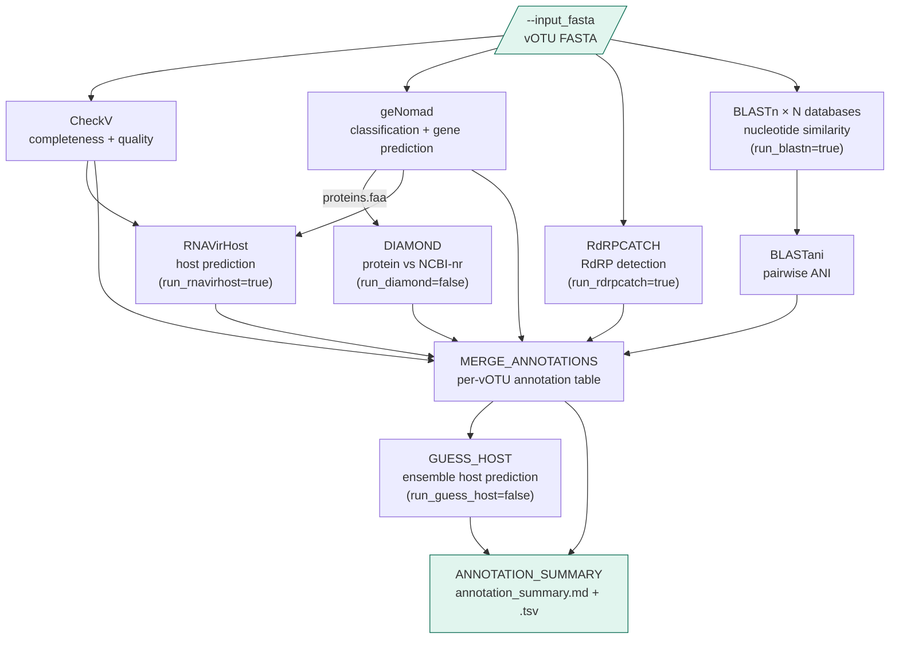

# wvdb_annotate

Viral genome annotation pipeline. Takes a FASTA file of viral genomes
(e.g. the `vclust_centroids.fasta` output of `wvdb_build`) and produces
completeness assessment, classification, RdRP detection, nucleotide and
protein similarity searches, host prediction, and a merged per-vOTU
annotation table.

This pipeline lives in the `wvdb-annotate/` subdirectory of the wvdb
repository, alongside `wvdb-build/`.

---

## Pipeline overview



All steps except RNAVirHost run in parallel from the input FASTA.
RNAVirHost runs sequentially after CheckV and geNomad complete,
as it requires their outputs to generate its input order file.

### Step control

| Step | Default | Param to disable/enable |
|---|---|---|
| CheckV | always on | — |
| geNomad | always on | — |
| RdRPCATCH | on | `--run_rdrpcatch false` |
| BLASTn | on | `--run_blastn false` |
| DIAMOND | off | `--run_diamond true` |
| RNAVirHost | on | `--run_rnavirhost false` |
| GUESS_HOST | off | `--run_guess_host true` |

---

## Repository structure

```
wvdb-annotate/
├── main.nf                     # Entry point; wires all annotation steps
├── nextflow.config             # Params, profiles (local, slurm, slurm_nomem, cluster, conda, test)
├── conf/
│   └── base.config             # Per-process CPU/memory resource labels
├── modules/
│   ├── checkv.nf               # CheckV quality assessment
│   ├── genomad.nf              # geNomad classification + gene prediction
│   ├── rdrpcatch.nf            # RdRPCATCH RdRP detection
│   ├── blastn_tools.nf         # BLASTN + BLASTANI (one process per database, parallel)
│   ├── diamond.nf              # DIAMOND protein search (scaffolded)
│   ├── rnavirhost.nf           # RNAVirHost host prediction
│   └── summary.nf              # MERGE_ANNOTATIONS, GUESS_HOST, ANNOTATION_SUMMARY
├── bin/                        # Python scripts (auto-added to PATH by Nextflow)
│   ├── blastani_nayfach.py     # Compute pairwise ANI from blastn tabular output
│   ├── merge_annotations.py    # Combine all annotation outputs per vOTU
│   ├── guess_host.py           # Ensemble host prediction (optional LLM)
│   ├── run_rnavirhost.py       # RNAVirHost wrapper + order.csv generation
│   └── annotation_summary.py  # Per-step annotation counts → TSV + markdown report
├── envs/
│   └── wvdb_annotate.yml       # Conda environment for all tools
└── test/
    └── data/
        └── test_votus.fasta    # Small test input
```

---

## Dependencies

All tools except RdRPCATCH are managed via `envs/wvdb_annotate.yml`.

| Tool | Version | Notes |
|---|---|---|
| Nextflow | ≥ 23.10 | Requires Java 11+ |
| checkv | ≥ 1.0.3 | |
| genomad | ≥ 1.8.0 | Requires separate database download (see below) |
| blastn | 2.16.0+ | Via `blast` conda package |
| diamond | ≥ 2.0.9 | Protein search; scaffolded (run_diamond=false by default) |
| Python | 3.11 | biopython (SeqIO, Entrez), pandas, numpy, requests |
| rdrpcatch | latest | Separate `rdrpcatch` conda env required (Python 3.12) |

---

## Installation

### 1. Create the conda environment

```bash
mamba env create -f envs/wvdb_annotate.yml
# If mamba fails to solve:
# conda env create -f envs/wvdb_annotate.yml

conda activate wvdb-annotate
```

### 2. Create the RdRPCATCH environment

RdRPCATCH requires Python 3.12 and cannot share the `wvdb-annotate`
environment (Python 3.11). Create a dedicated environment:

```bash
# Option A — install from bioconda directly (recommended)
conda create -n rdrpcatch -c bioconda rdrpcatch

# Option B — create from the provided yml
mamba env create -f envs/wvdb_rdrpcatch.yml
```

Then download the RdRPCATCH databases:

```bash
conda activate rdrpcatch
rdrpcatch databases --destination-dir /path/to/rdrp_catch_db
```

The pipeline automatically uses the `rdrpcatch` conda environment for the
`RDRPCATCH` process via a per-process `conda` directive in `nextflow.config`.
If your rdrpcatch environment is installed at a non-standard prefix, override
the path:

```bash
nextflow run main.nf --rdrpcatch_conda_env /path/to/conda/envs/rdrpcatch ...
```

### 3. Download the geNomad database

The geNomad database must be downloaded separately after installing genomad.
The recommended method uses the built-in download command:

```bash
conda activate wvdb-annotate
genomad download-database /path/to/genomad_db/
```

This downloads and decompresses the database (~3.5 GB) into the specified
directory. Alternatively, download manually from Zenodo following the
instructions at: https://github.com/apcamargo/genomad

Pass the database directory to the pipeline via `--genomad_db /path/to/genomad_db`.

### 4. Download the CheckV database

```bash
checkv download_database /path/to/checkv-db/
```

### 5. Build BLAST databases

For each FASTA in your BLASTn database list, build the BLAST index if not
already done:

```bash
makeblastdb -in /path/to/db.fna -dbtype nucl -out /path/to/db.fna
```

All index files must reside in the same directory as the `.fna` file.

### 6. Validate the pipeline DAG

```bash
cd wvdb-annotate
nextflow run main.nf -stub -profile local
```

---

## BLASTn database configuration

BLASTn searches run in parallel against all databases listed in a
two-column CSV file:

```csv
name,path
IMGVR,/p/vast1/mlbiomon/ref_data/IMG-VR_2025-12-02/IMGVR5_UViG.fna
CHVD,/p/vast1/mlbiomon/ref_data/CHVD_tisza2021/CHVD_virus_sequences_v1.1.fasta
UHGV,/p/vast1/mlbiomon/ref_data/UHGV_nayfach2025/nayfach2025_votus_hq_plus.fna
VIRE,/p/vast1/mlbiomon/ref_data/VIRE/all_vire.fna
core_nt,/p/vast1/kpath/blastdb/core_nt/core_nt_Jul25_filt
```

- `name` — short label used for output filenames and report columns
- `path` — full path to the BLAST database (`.fna` file or db prefix)
- Header row (`name,path`) is required

Pass this file via `--blastn_dbs /path/to/blastn_dbs.csv`. One `BLASTN`
and `BLASTANI` process pair runs per row, all in parallel. To add a new
database, add a row to the CSV and rerun with `-resume` — only the new
database will be searched.

---

## Running the pipeline

### SLURM cluster (production)

```bash
conda activate wvdb-annotate
cd wvdb-annotate

nextflow run main.nf -profile cluster,conda \
    --input_fasta   /path/to/votus_final.fasta \
    --outdir        /path/to/results \
    --checkvdb      /path/to/checkv-db-v1.5 \
    --genomad_db    /path/to/genomad_db \
    --rdrpcatch_db  /path/to/rdrp_catch_db \
    --blastn_dbs    /path/to/blastn_dbs.csv \
    -resume
```

### With DIAMOND protein search enabled

```bash
nextflow run main.nf -profile cluster,conda \
    --input_fasta   /path/to/votus_final.fasta \
    --outdir        /path/to/results \
    --checkvdb      /path/to/checkv-db-v1.5 \
    --genomad_db    /path/to/genomad_db \
    --blastn_dbs    /path/to/blastn_dbs.csv \
    --run_diamond   true \
    --diamond_db    /path/to/nr.dmnd \
    -resume
```

### Skipping optional steps

```bash
# Run only CheckV + geNomad (no additional databases required)
nextflow run main.nf -profile cluster,conda \
    --input_fasta      /path/to/votus.fasta \
    --outdir           /path/to/results \
    --checkvdb         /path/to/checkv-db \
    --genomad_db       /path/to/genomad_db \
    --run_rdrpcatch    false \
    --run_blastn       false \
    --run_rnavirhost   false \
    -resume
```

---

## Parameters

| Parameter | Default | Description |
|---|---|---|
| `--input_fasta` | required | Input vOTU FASTA file |
| `--outdir` | required | Output directory |
| `--checkvdb` | required | CheckV database directory |
| `--genomad_db` | required | geNomad database directory |
| `--rdrpcatch_db` | null | RdRPCATCH database directory (required if `run_rdrpcatch=true`) |
| `--blastn_dbs` | null | Path to BLASTn database CSV (required if `run_blastn=true`) |
| `--diamond_db` | null | DIAMOND protein database `.dmnd` (required if `run_diamond=true`) |
| `--run_rdrpcatch` | true | Scan for RNA-dependent RNA polymerase |
| `--run_blastn` | true | BLASTn against all databases in `blastn_dbs` CSV |
| `--run_diamond` | false | DIAMOND protein search (scaffolded, pending script) |
| `--run_rnavirhost` | true | Host prediction (requires CheckV + geNomad output) |
| `--run_guess_host` | false | Ensemble LLM host prediction (pending script) |
| `--rdrpcatch_bin` | `rdrpcatch` | Path to rdrpcatch binary if not in PATH |
| `--blastn_evalue` | `1e-3` | BLASTn e-value threshold |
| `--blastn_max_targets` | 10 | BLASTn max target sequences per query |
| `--blastn_pident` | 90 | BLASTn minimum percent identity |
| `--threads` | 100 | Thread count for high-CPU processes |
| `--max_memory` | `'64 GB'` | Memory cap for high/medium-CPU processes |
| `--max_memory_low` | `'16 GB'` | Memory cap for low-CPU processes |
| `--max_time` | `'24 h'` | Maximum runtime for any process |
| `--conda_env` | auto | Conda env yml path or prefix |

---

## Output structure

```
outdir/
├── checkv/
│   └── checkv_out/
│       ├── quality_summary.tsv
│       ├── completeness.tsv
│       └── contamination.tsv
├── genomad/
│   └── genomad_out/
│       ├── <name>_summary/<name>_virus_summary.tsv
│       ├── <name>_find_proviruses/<name>_provirus.fna
│       └── <name>_annotate/<name>_proteins.faa
├── rdrpcatch/                  # only if run_rdrpcatch=true
│   └── rdrpcatch_out/
│       └── rdrpcatch_results.tsv
├── blastn/                     # only if run_blastn=true
│   ├── IMGVR/
│   │   ├── IMGVR.blastn.tsv
│   │   └── IMGVR.blastn.ani.tsv
│   ├── CHVD/
│   │   ├── CHVD.blastn.tsv
│   │   └── CHVD.blastn.ani.tsv
│   └── ...                     # one subdirectory per row in blastn_dbs.csv
├── diamond/                    # only if run_diamond=true
│   └── diamond_out.tsv
├── rnavirhost/                 # only if run_rnavirhost=true
│   └── rnavirhost_out/
│       └── rnavirhost_predictions.tsv
├── annotations/
│   ├── merged_annotations.tsv  # per-vOTU annotation table (all tools)
│   └── host_predictions.tsv    # only if run_guess_host=true
├── annotation_summary.tsv      # per-step annotation counts (machine-readable)
└── annotation_summary.md       # annotation counts report (human-readable)
```

---

## Development notes

### Running from the correct directory

Always run Nextflow from inside `wvdb-annotate/`:

```bash
cd /path/to/repo/wvdb-annotate
nextflow run main.nf ...
```

### Memory configuration across clusters

| Cluster config | Profile | Notes |
|---|---|---|
| `DefMemPerCPU` set | `slurm` | Explicit `--mem` requests work normally |
| `DefMemPerNode=UNLIMITED` | `slurm_nomem` | Custom profile — omits `--mem` flag |
| 128-CPU / 2TB exclusive nodes | `cluster` | Custom profile — `--exclusive`, 128 CPUs, memory=null |

`slurm_nomem` and `cluster` are custom profiles defined in `nextflow.config`;
they are not built-in Nextflow terms.

### BLAST database staging

BLAST databases are passed as `val` strings (not `path` inputs) to prevent
Nextflow from staging only the `.fna` file away from its index files. All
index files must remain in the same directory as the database file.

### geNomad output path naming

geNomad names its output subdirectories after the input FASTA filename
(without extension), using `${input_fasta.baseName}` in the module. If
the input FASTA has a compound extension (e.g. `votus.final.fasta`),
`baseName` strips only the last extension → `votus.final`. Rename the
input file to a simple name if needed.

### Pending bin/ scripts

The following scripts are not yet implemented; their modules are stubbed
and will be updated when the scripts are uploaded:

| Script | Used by | Status |
|---|---|---|
| `merge_annotations.py` | `MERGE_ANNOTATIONS` | pending upload |
| `guess_host.py` | `GUESS_HOST` | pending upload |
| `run_rnavirhost.py` | `RNAVIRHOST` | pending upload |
| `annotation_summary.py` | `ANNOTATION_SUMMARY` | to be written |
