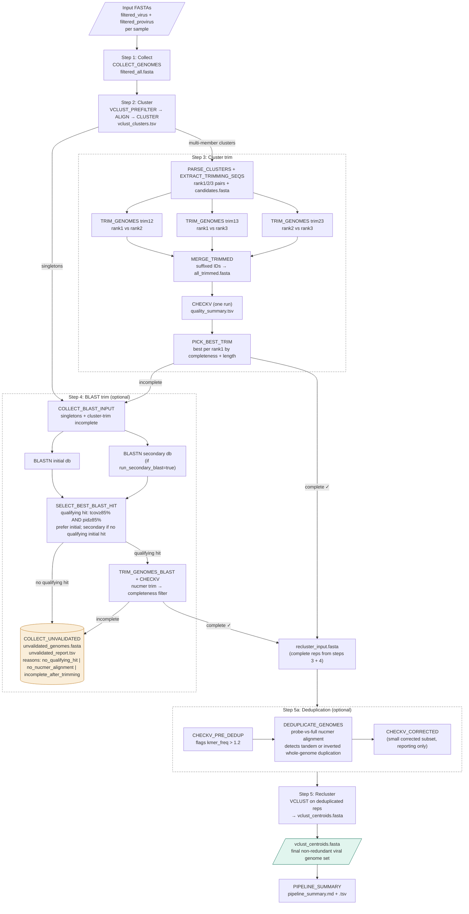

# wvdb_build

Viral genome database build pipeline. Collects viral and proviral genome
assemblies across samples, clusters them by sequence identity, trims chimeric
assemblies using nucmer pairwise alignments, assesses completeness with CheckV,
and produces a non-redundant set of representative genomes.

This pipeline lives in the `wvdb-build/` subdirectory of the wvdb repository,
alongside `wvdb-annotate/` and other workflows.

---

## Pipeline overview



### Sequence routing summary

| Sequence type | After step 3 | After step 4 | Final destination |
|---|---|---|---|
| Multi-member cluster, trimmed complete | → dedup → recluster | — | `vclust_centroids.fasta` |
| Multi-member cluster, trimmed incomplete | → blast_trim | qualifying hit, complete → dedup → recluster | `vclust_centroids.fasta` |
| Multi-member cluster, trimmed incomplete | → blast_trim | no qualifying hit or incomplete | `unvalidated_genomes.fasta` |
| Singleton | → blast_trim | qualifying hit, complete → dedup → recluster | `vclust_centroids.fasta` |
| Singleton | → blast_trim | no qualifying hit or incomplete | `unvalidated_genomes.fasta` |
| Any | — | — (run_initial_blast=false) | `unvalidated_genomes.fasta` |

### Step 3 trimming detail

All three trim passes (trim12, trim13, trim23) run in parallel using the
pre-indexed `trimming_candidates.fasta`. Their outputs are merged with
suffixed IDs (`<rank1_id>_trim12` etc.) so a **single CheckV run** covers
all three. `PICK_BEST_TRIM` then selects the best result per rank1 sequence
by completeness (primary) and length (tiebreaker), with trim12 preferred
on a complete tie.

### Step 4 qualifying-hit filter

A BLAST hit only proceeds to nucmer trimming if it clears **both**:
- target coverage (`tcov`) ≥ `--blast_trim_min_tcov` (default 85%)
- percent identity (`pid`) ≥ `--blast_trim_min_pid` (default 85%, genus-level)

Target coverage (not query coverage) is used because the untrimmed query
may be larger than the true genome due to chimeric/host-contaminant
regions, so full query coverage of the reference hit is not expected.
This filter is applied **once**, in `SELECT_BEST_BLAST_HIT`, before any
database is chosen — a query with a hit that exists but doesn't clear
these thresholds is treated identically to a query with no hit at all;
both are combined into a single `no_qualifying_hit` category routed to
`unvalidated/`. For datasets of novel viruses, most raw "hits" are very
short/low-coverage matches that are not meaningfully different from no
hit at all, which is why this combined category exists.

nucmer's own `show-coords -I` filter (inside `trim_genomes.py`) is a
*different, narrower* check — it discards spurious short alignment
fragments within an already-qualifying pair, it does not re-apply the
qualifying-hit gate. Its threshold is deliberately set a few points below
the qualifying-hit threshold (`--trim_identity_buffer`, default 5) so it
can never reject the legitimate alignment block for a pair that already
passed the real gate above.

Even with a qualifying hit, nucmer can occasionally fail to produce a
single usable alignment block — e.g. if the true homology is fragmented
across several sub-length pieces that individually don't clear
`show-coords -L 1000`, even though their combined coverage was enough to
qualify upstream. These pairs are tracked explicitly in
`no_nucmer_alignment_ids.txt` and routed to `unvalidated/` with reason
`no_nucmer_alignment`, rather than being silently dropped. Every query
that enters `blast_trim_input.fasta` therefore has exactly one of three
tracked fates: `complete`, `incomplete_after_trimming`,
`no_qualifying_hit`, or `no_nucmer_alignment` — the pipeline_summary
counts for these should always sum back to the total input exactly.

### Step 5a deduplication detail

Some assemblies contain a genome duplicated as two tandem or
inverted-repeat copies — a known assembler artifact, flagged by CheckV's
`kmer_freq` metric (values near 2.0). `DEDUPLICATE_GENOMES` detects this
via alignment: a short probe from the start of each flagged sequence is
aligned against the full sequence with nucmer (which searches both
strands, catching inverted duplications as well as tandem ones). Only
sequences with clean, well-separated, high-identity, evenly-spaced
repeat copies are auto-corrected to a single copy; anything ambiguous
(e.g. a rotated/irregular repeat) is left untouched and flagged for
manual review rather than risking an incorrect edit. See
`dedup/dedup_report.tsv` and `dedup/plots/` for per-sequence detail.
Disable with `--run_deduplication false`.

---

## Repository structure

```
wvdb-build/
├── main.nf                         # Entry point; wires all steps
├── nextflow.config                 # Params, profiles (local, slurm, slurm_nomem, cluster, conda, test)
├── conf/
│   └── base.config                 # Per-process CPU/memory resource labels
├── modules/
│   ├── collect.nf                  # Step 1: collect and merge input FASTAs
│   ├── vclust.nf                   # Steps 2 & 5: vclust prefilter/align/cluster + centroids
│   ├── cluster_trim_tools.nf       # Step 3 processes: parse_clusters, extract_seqs,
│   │                               #   trim_genomes (×3), merge_trimmed, checkv, pick_best_trim,
│   │                               #   fetch_blast_input_seqs, completeness_filter
│   ├── blast_trim_tools.nf         # Step 4 processes: blastn, blastani, select_best_hit,
│   │                               #   trim_genomes_blast, merge_trimmed, checkv,
│   │                               #   completeness_filter, collect_unvalidated
│   ├── dedup_tools.nf              # Step 5a: DEDUPLICATE_GENOMES (whole-genome dup correction)
│   └── summary.nf                  # PIPELINE_SUMMARY: sequence counts report
├── subworkflows/
│   ├── cluster_trim.nf             # Step 3: parallel nucmer trimming → single CheckV
│   └── blast_trim.nf               # Step 4: BLAST-mode reference trimming (optional)
├── bin/                            # Python scripts (auto-added to PATH by Nextflow)
│   ├── parse_clusters.py           # Extract rank1/2/3 pairs from vclust clusters
│   ├── trim_genomes.py             # Nucmer-based trimming (cluster mode + BLAST mode)
│   ├── merge_trimmed.py            # Combine trim12/13/23 FASTAs with suffixed IDs for CheckV
│   ├── pick_best_trim.py           # Select best trimming per rank1 by completeness + length
│   ├── select_best_blast_hit.py    # Qualifying-hit filter (tcov+pid) + route to initial/secondary db
│   ├── blastani_nayfach.py         # Compute pairwise ANI from blastn tabular output
│   ├── completeness_filter.py      # Filter sequences by CheckV completeness threshold
│   ├── collect_unvalidated.py      # Gather unvalidated seqs with reason report
│   ├── detect_genome_duplication.py # Alignment-based whole-genome duplication detection/correction
│   └── pipeline_summary.py         # Sequence counts at each step → TSV + markdown report
├── envs/
│   └── wvdb_build.yml              # Conda environment for all tools
└── test/
    └── data/                       # Small test inputs (sample/assembly/run/ structure)
```

---

## Dependencies

All tools are managed via the conda environment in `envs/wvdb_build.yml`.

| Tool | Version | Notes |
|---|---|---|
| Nextflow | ≥ 23.10 | Requires Java 11+ |
| seqkit | 2.9.0 | |
| vclust | 1.3.1 | |
| blastn | 2.16.0+ | Via `blast` conda package |
| checkv | ≥ 1.0.3 | |
| nucmer | 4.0.1 | All trimming steps; via `mummer4` conda package |
| diamond | ≥ 2.0.9 | CheckV hard dependency |
| Python | 3.11 | biopython, pandas, numpy, matplotlib required by bin/ scripts |

---

## Installation

### 1. Create the conda environment

```bash
# Recommended: use mamba for faster solving
conda install -n base -c conda-forge mamba
mamba env create -f envs/wvdb_build.yml

# If mamba fails to solve, fall back to conda:
# conda env create -f envs/wvdb_build.yml

conda activate wvdb-build
```

### 2. Verify all tools resolve

```bash
seqkit version                    # seqkit v2.9.0
vclust -v                         # vclust 1.3.1
blastn -version                   # blastn: 2.16.0+
checkv -h 2>&1 | head -1          # checkv 1.x
nucmer --version                  # 4.0.1
nextflow -v                       # nextflow version 23.x
```

Verify Python helper scripts:

```bash
for script in parse_clusters.py trim_genomes.py merge_trimmed.py pick_best_trim.py \
              select_best_blast_hit.py blastani_nayfach.py completeness_filter.py \
              collect_unvalidated.py detect_genome_duplication.py pipeline_summary.py; do
    python bin/$script --help > /dev/null 2>&1 \
        && echo "OK: $script" \
        || echo "CHECK: $script"
done
```

### 3. Validate the pipeline DAG (no data needed)

```bash
cd wvdb-build
nextflow run main.nf -stub -profile local
```

---

## Running the pipeline

### SLURM cluster (production)

```bash
conda activate wvdb-build
cd wvdb-build

nextflow run main.nf -profile slurm,conda \
    --fasta_list        /path/to/fasta_list.txt \
    --outdir            /path/to/results \
    --checkvdb          /path/to/checkv-db-v1.5 \
    --initial_blastdb   /path/to/esviritu_plus_refseq_virus.fna \
    --secondary_blastdb /path/to/IMGVR5_UViG.fna \
    --run_secondary_blast true \
    -resume
```

The `-profile slurm,conda` combination uses SLURM as the executor and
activates the conda environment for every submitted job. This is required
because SLURM jobs do not inherit the interactive `conda activate`.

For clusters where `DefMemPerNode=UNLIMITED` (memory not tracked per job),
use the `slurm_nomem` profile instead of `slurm`. This is a custom profile
defined in `nextflow.config` that omits the `--mem` flag from sbatch
submissions, letting SLURM manage memory allocation automatically:

```bash
nextflow run main.nf -profile slurm_nomem,conda ...
```

For the dedicated 128-CPU / 2TB cluster nodes, use the `cluster` profile
which requests full exclusive node access and sets threads/memory
accordingly:

```bash
nextflow run main.nf -profile cluster,conda \
    --fasta_list        /path/to/fasta_list.txt \
    --outdir            /path/to/results \
    --checkvdb          /path/to/checkv-db \
    --initial_blastdb   /path/to/esviritu_plus_refseq_virus.fna \
    -resume
```

### Initial BLAST database only (no secondary)

```bash
nextflow run main.nf -profile slurm,conda \
    --fasta_list      /path/to/fasta_list.txt \
    --outdir          /path/to/results \
    --checkvdb        /path/to/checkv-db \
    --initial_blastdb /path/to/esviritu_plus_refseq_virus.fna \
    -resume
```

### Skipping BLAST trim entirely

When `--run_initial_blast false`, all singletons and cluster-trim
incomplete sequences go directly to `unvalidated/` with no BLAST search:

```bash
nextflow run main.nf -profile slurm,conda \
    --fasta_list        /path/to/fasta_list.txt \
    --outdir            /path/to/results \
    --checkvdb          /path/to/checkv-db \
    --run_initial_blast false \
    -resume
```

### Local development / macOS

```bash
conda activate wvdb-build
cd wvdb-build

nextflow run main.nf -profile local \
    --fasta_list        /path/to/fasta_list.txt \
    --outdir            /path/to/results \
    --checkvdb          /path/to/checkv-db \
    --run_initial_blast false \
    --max_memory        '32 GB' \
    -resume
```

---

## Input file: fasta_list.txt

`--fasta_list` points to a plain text file listing the virus and provirus
FASTA files to merge, one absolute path per line:

```
/p/vast1/mlbiomon/.../batch1/assembly/sample_all/filtered_virus_all.fasta
/p/vast1/mlbiomon/.../batch1/assembly/sample_all/filtered_provirus_all.fasta
/p/vast1/mlbiomon/.../batch2/assembly/sample_all/filtered_virus_all.fasta
/p/vast1/mlbiomon/.../batch2/assembly/sample_all/filtered_provirus_all.fasta
```

Generate it with `find`:

```bash
find /path/to/assemblies/ \
    -name "filtered_virus*.fasta" -o -name "filtered_provirus*.fasta" \
    | sort > fasta_list.txt
```

> **Paths must be absolute.** Relative paths are resolved by the shell
> inside each process's isolated work directory, not the directory you run
> `nextflow run` from — so a relative path that looks correct at the
> command line will not resolve correctly inside the pipeline. Always use
> full absolute paths in `fasta_list.txt`.

Lines are classified by filename: any line containing `provirus` is treated
as a provirus FASTA; any other line containing `virus` is treated as a virus
FASTA. Empty lines and lines starting with `#` are ignored.

---

## Parameters

| Parameter | Default | Description |
|---|---|---|
| `--fasta_list` | required | Text file listing absolute paths to virus/provirus FASTAs (one per line) |
| `--outdir` | required | Output directory |
| `--checkvdb` | required | CheckV database directory (e.g. `checkv-db-v1.5`) |
| `--initial_blastdb` | null | Primary BLAST reference db — required if `run_initial_blast=true` |
| `--secondary_blastdb` | null | Secondary BLAST reference db — required if `run_secondary_blast=true` |
| `--run_initial_blast` | true | Search `initial_blastdb` for singletons + incomplete sequences |
| `--run_secondary_blast` | false | Also search `secondary_blastdb`; initial db hit preferred when both qualify |
| `--blast_trim_min_tcov` | 85.0 | Minimum target coverage %% for a BLAST hit to qualify for trimming |
| `--blast_trim_min_pid` | 85.0 | Minimum percent identity (genus-level) for a BLAST hit to qualify for trimming |
| `--trim_identity_buffer` | 5.0 | Safety margin subtracted from the qualifying/clustering threshold when setting nucmer's per-block identity filter |
| `--run_deduplication` | true | Detect + correct tandem/inverted whole-genome duplications before final reclustering |
| `--dedup_kmer_threshold` | 1.2 | CheckV `kmer_freq` threshold to flag a duplication candidate |
| `--dedup_min_identity` | 95.0 | Minimum %% identity for a probe hit to count as a repeat copy |
| `--dedup_min_coverage` | 0.90 | Minimum fractional coverage of the probe for a hit to count |
| `--ani` | 0.95 | ANI threshold for vclust clustering |
| `--qcov` | 0.85 | Query coverage threshold for vclust |
| `--completeness` | 90 | CheckV completeness threshold (%) |
| `--threads` | 100 | Thread count for high-CPU processes |
| `--max_memory` | `'64 GB'` | Memory cap for high/medium-CPU processes |
| `--max_memory_low` | `'16 GB'` | Memory cap for low-CPU processes |
| `--max_time` | `'24 h'` | Maximum runtime for any process |
| `--conda_env` | auto | Conda env yml path or prefix; overrides default in `conda` profile |

> **BLAST database note:** BLAST index files must reside in the same directory
> as the `.fna` file. The pipeline passes database paths as strings (not staged
> files) to preserve index file access. Do not symlink individual files.

---

## Output structure

```
outdir/
├── 1_collect/
│   ├── filtered_all.fasta              # all input genomes merged
│   ├── filtered_all.length.txt
│   ├── filtered_virus_all.fasta
│   └── filtered_provirus_all.fasta
├── 2_clustered/
│   ├── vclust_clusters.tsv             # cluster assignments (object<TAB>cluster)
│   └── vclust_ani.ids.tsv              # sequence ID/length file from vclust align
├── 3_cluster_trim/
│   ├── pairs12.tsv                     # rank1 vs rank2 pairs
│   ├── pairs13.tsv                     # rank1 vs rank3 pairs
│   ├── pairs23.tsv                     # rank2 vs rank3 pairs
│   ├── singletons.txt                  # 1-member clusters → step 4
│   ├── candidate_ids.txt               # rank1/2/3 IDs for nucmer
│   ├── trimming_candidates.fasta       # extracted rank1/2/3 sequences
│   ├── trim12/                         # trim12 nucmer outputs (trimmed.fasta, .bed,
│   │                                    #   no_nucmer_alignment.txt — informational only;
│   │                                    #   PICK_BEST_TRIM already falls back to trim13/23)
│   ├── trim13/                         # trim13 nucmer outputs (same file set as trim12/)
│   ├── trim23/                         # trim23 nucmer outputs (same file set as trim12/)
│   ├── all_trimmed.fasta               # merged with suffixed IDs for CheckV
│   ├── checkv/                         # CheckV quality assessment (single run)
│   ├── complete_reps.fasta             # complete trimmed reps → step 5
│   └── blast_trim_ids.txt              # incomplete cluster IDs → step 4
├── 4_blast_trim/                       # only created if run_initial_blast=true
│   ├── blast_trim_input.fasta          # singletons + incomplete from step 3
│   ├── blast_trim_input_ids.txt        # IDs of the above
│   ├── initial/                        # blastn + blastani outputs (initial db)
│   │   ├── initial.blastn.tsv
│   │   ├── initial.blastn.ani.tsv
│   │   ├── initial.trimmed.fasta       # nucmer-trimmed reference-side output
│   │   ├── initial.trimming.bed
│   │   └── initial.no_nucmer_alignment.txt  # qualifying pairs with no usable alignment
│   ├── secondary/                      # same structure as initial/ (if run_secondary_blast=true)
│   ├── initial_hits.tsv                # SELECT_BEST_BLAST_HIT: qualifying rows routed to initial db
│   ├── secondary_hits.tsv              # qualifying rows routed to secondary db (no qualifying initial hit)
│   ├── no_hit_ids.txt                  # no qualifying hit in either db → unvalidated
│   ├── blast_trimmed.fasta             # merged trimmed output (initial + secondary)
│   ├── checkv/                         # CheckV quality assessment on blast_trimmed.fasta
│   ├── cluster_reps_complete.fasta     # complete reps → step 5
│   └── cluster_reps_incomplete_or_na.txt # incomplete after CheckV → unvalidated
├── unvalidated/
│   ├── unvalidated_genomes.fasta       # untrimmed seqs: no qualifying BLAST hit or incomplete after trim
│   └── unvalidated_report.tsv          # per-seq reason: no_qualifying_hit | no_nucmer_alignment | incomplete_after_trimming
├── dedup/                              # only created if run_deduplication=true
│   ├── checkv_pre_dedup/               # CheckV on recluster_input.fasta (flags candidates)
│   ├── deduplicated_all.fasta          # recluster_input with clean duplications corrected
│   ├── corrected_only.fasta            # just the auto-corrected sequences, for examination
│   ├── flagged_for_review.fasta        # ambiguous cases left untouched, needing manual review
│   ├── dedup_report.tsv                # per-sequence decision + metrics (identity, coverage, orientation)
│   ├── plots/                          # one PNG per flagged sequence showing probe alignment hits
│   └── checkv_corrected/               # CheckV on corrected_only.fasta (reporting only)
├── 5_reclustered/
│   ├── recluster_input.fasta           # deduplicated complete reps from steps 3 + 4
│   ├── vclust_clusters.tsv
│   ├── vclust_centroids.txt
│   └── vclust_centroids.fasta          # ← FINAL OUTPUT: non-redundant genome set
├── pipeline_summary.tsv                # sequence counts at each step (machine-readable)
└── pipeline_summary.md                 # sequence counts report (human-readable)
```

---

## Development notes

### Running from the correct directory

Always run Nextflow from inside `wvdb-build/`:

```bash
cd /path/to/repo/wvdb-build
nextflow run main.nf ...
```

Nextflow resolves `./modules/`, `./subworkflows/`, and `./bin/` relative to
`main.nf`. Running from the repo root will produce "invalid include source" errors.

### Conda environment on the cluster

SLURM jobs run in a fresh shell and do not inherit `conda activate` from the
login session. Always use `-profile slurm,conda` for cluster runs.

### BLAST database staging

BLAST databases are passed as `val` strings (not `path` inputs) to prevent
Nextflow from staging only the `.fna` file away from its index files. All
index files must remain in the same directory as the database file.

### Memory configuration across clusters

| Cluster config | Profile to use | Notes |
|---|---|---|
| `DefMemPerCPU` set | `slurm` | Explicit `--mem` requests work normally |
| `DefMemPerNode=UNLIMITED` | `slurm_nomem` | Custom profile — omits `--mem` flag |
| 128-CPU / 2TB exclusive nodes | `cluster` | Custom profile — `--exclusive`, 128 CPUs, memory=null |

All three are custom profiles defined in `nextflow.config` under the `profiles {}`
block — not built-in Nextflow terms. Override memory caps at runtime:

```bash
nextflow run main.nf --max_memory '120 GB' --max_memory_low '8 GB' ...
```

### Updating the conda environment

```bash
mamba env update -n wvdb-build -f envs/wvdb_build.yml --prune
# If mamba fails to solve:
# conda env remove -n wvdb-build
# conda env create -f envs/wvdb_build.yml
nextflow run main.nf -stub -profile local
git add envs/wvdb_build.yml && git commit -m "feat: update conda env"
```

### Single-gate identity threshold design

The qualifying-hit filter (`tcov`/`pid` in `select_best_blast_hit.py`) is
intentionally the **only** place a BLAST hit's quality is judged. An
earlier version of this pipeline also applied an independent identity
filter inside `trim_genomes.py`'s nucmer step; because the two thresholds
were defined differently (percentage scale mismatch, and later a stricter
default than the upstream gate), pairs that legitimately qualified
upstream were silently dropped downstream with no error and no count
anywhere reflecting the loss — the pipeline_summary math simply didn't
add up. If you need to add another filtering step anywhere in this
pipeline, thread the same parameter through rather than introducing a
second independently-tuned threshold, and make sure every dropped
sequence is written to an explicit output file with a named reason.

### task.ext.publish_dir pattern

Processes in `cluster_trim_tools.nf` and `blast_trim_tools.nf` use
`publishDir { "${params.outdir}/${task.ext.publish_dir}" }` with a closure.
The closure form is required because `task.ext` is only populated at runtime.
Values are set via `withName` selectors in `nextflow.config`.
